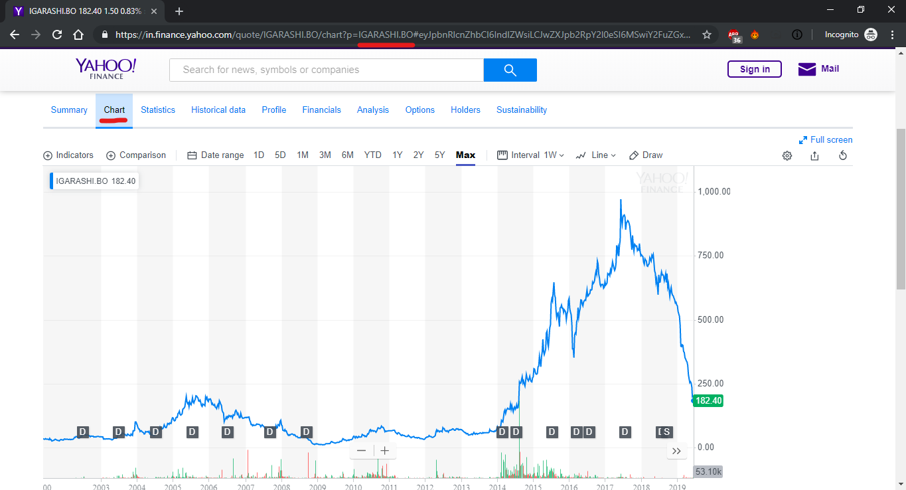
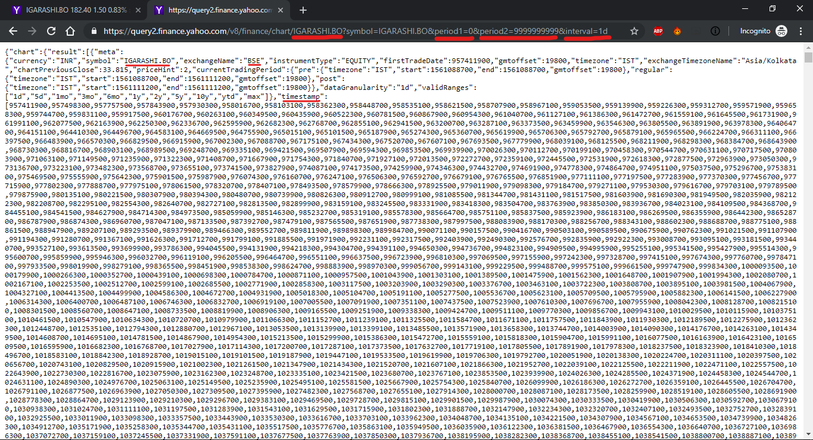
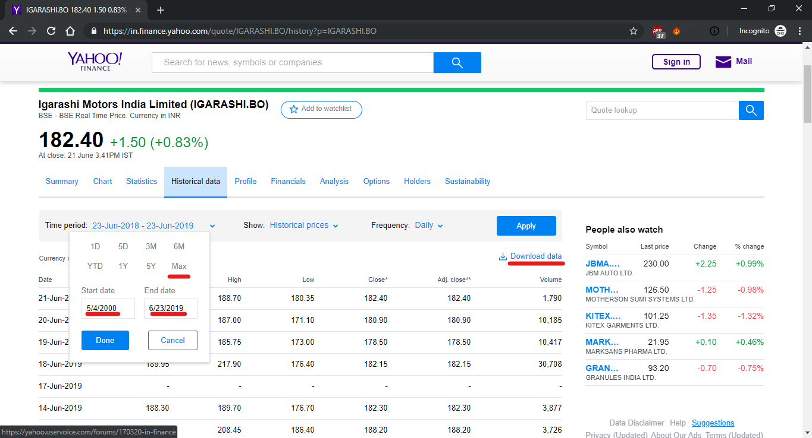
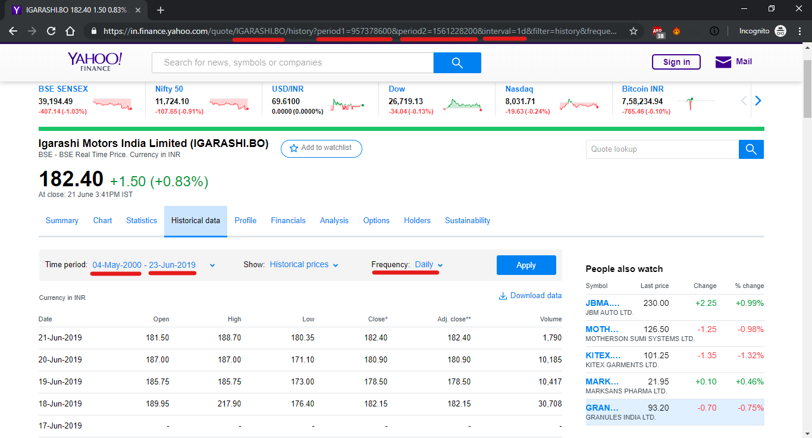

<h1 style="text-align: center;">stock-market-scraper</h1>

<br/>

# Let's see the scraping idea
<br/>

**Yahoo has gone to a Reactjs front end which means if you analyze the request headers from the client to the backend you can get the actual JSON they use to populate the client side stores.**

<br/>

### Hosts:
* `query1.finance.yahoo.com` HTTP/1.0
* `query2.finance.yahoo.com` HTTP/1.1 [difference between HTTP/1.0 & HTTP/1.1](https://stackoverflow.com/questions/246859/http-1-0-vs-1-1)  

If you plan to use a proxy or persistent connections use `query2.finance.yahoo.com`. But for the purposes of this post the host used for the example URLs is not meant to imply anything about the path it's being used with.

> We will use HTTP/1.1


### Fundamental Data
* `/v10/finance/quoteSummary/AAPL?modules=` (Full list of modules below)

(substitute your symbol for: AAPL)

#### Inputs for the `?modules=` query:

* ```modules = [
   'assetProfile',
   'incomeStatementHistory',
   'incomeStatementHistoryQuarterly',
   'balanceSheetHistory',
   'balanceSheetHistoryQuarterly',
   'cashflowStatementHistory',
   'cashflowStatementHistoryQuarterly',
   'defaultKeyStatistics',
   'financialData',
   'calendarEvents',
   'secFilings',
   'recommendationTrend',
   'upgradeDowngradeHistory',
   'institutionOwnership',
   'fundOwnership',
   'majorDirectHolders',
   'majorHoldersBreakdown',
   'insiderTransactions',
   'insiderHolders',
   'netSharePurchaseActivity',
   'earnings',
   'earningsHistory',
   'earningsTrend',
   'industryTrend',
   'indexTrend',
   'sectorTrend' ]
   ```
#### Example URL:

* `https://query1.finance.yahoo.com/v10/finance/quoteSummary/AAPL?modules=assetProfile%2CearningsHistory`

Querying for: `assetProfile` and `earningsHistory`

The `%2C` is the Hex representation of `,` and needs to be inserted between each module you request. [details about the hex encoding bit](https://stackoverflow.com/questions/6182356/what-is-2c-in-a-url)(if you care)  

<br/>

### Options contracts
* `/v7/finance/options/AAPL` (current expiration)
* `/v7/finance/options/AAPL?date=1579219200` (January 17, 2020 expiration)

#### Example URL:

* `https://query2.yahoo.finance.com/v7/finance/options/AAPL` (current expiration)
* `https://query2.yahoo.finance.com/v7/finance/options/AAPL?date=1579219200` (January 17, 2020 expiration)

Any valid future expiration represented as a UNIX timestamp can be used in the `?date=` query. If you query for the current expiration the JSON response will contain a list of all the valid expirations that can be used in the `?date=` query. ([here is a post explaining converting human readable dates to unix timestamp in Python](https://stackoverflow.com/questions/3682748/converting-unix-timestamp-string-to-readable-date))  

<br/>

### Price
* `/v8/finance/chart/AAPL?symbol=AAPL&period1=0&period2=9999999999&interval=3mo`  

#### Intervals:

* `&interval=3mo` 3 months, going back until initial trading date.
* `&interval=1d` 1 day, going back until initial trading date.
* `&interval=5m` 5 minuets, going back 80(ish) days.
* `&interval=1m` 1 minuet, going back 4-5 days.

How far back you can go with each interval is a little confusing and seems inconsistent. My assumption is that internally yahoo is counting in trading days and my naive approach was not accounting for holidays. Although that's a guess and YMMV.

`period1=`: unix timestamp representation of the date you wish to **start** at. Values below the initial trading date will be rounded up to the initial trading date.

`period2=`: unix timestamp representation of the date you wish to **end** at. Values greater than the last trading date will be rounded down to the most recent timestamp available.

**Note:** *If you query with a `period1=` (start date) that is too far in the past for the interval you've chosen, yahoo will return prices in the `3mo` interval regardless of what interval you requested.*

#### Add pre & post market data

`&includePrePost=true`

#### Add dividends & splits

`&events=div%2Csplit`

#### Example URL:  

* `https://query1.finance.yahoo.com/v8/finance/chart/AAPL?symbol=AAPL&period1=0&period2=9999999999&interval=1d&includePrePost=true&events=div%2Csplit`  

The above request will return all price data for ticker AAPL on a 1 day interval including pre and post market data as well as dividends and splits.

**Note:** *the values used in the price example url for `period1=` & `period2=` are to demonstrate the respective rounding behavior of each input.*


<br/>  

`The above article is taken from `[here](https://stackoverflow.com/a/47505102/8141330)`.`

<br/>  


### Dividents and Splits

Yahoo adjusts **all historical** prices to reflect a stock **split**. For example, `ISRG` was trading around $1000 prior to `2017/10/06`. Then on `2017/10/06`, it underwent a 3-for-1 stock split. As you can see, Yahoo's historical prices divided all prices by 3 (both prior to and after `2017/10/06`):
  
    


For **dividends**, let's say stock `ABC` closed at 200 on December 18. Then on December 19, the stock increases in price by `$2` but it pays out a `$1` dividend. In Yahoo's historical prices for XYZ, you will see that it closed at 200 on Dec 18 and 201 on Dec 19. Yahoo factors in the dividend in the **"Adj Close"** column for all the previous days. So the Close for Dec 18 would be 200, but the Adj Close would be 199.

For example, on 2017/09/15, SPY paid out a `$1.235` dividend. Yahoo's historical prices say that SPY's closing price on 2017/09/14 was 250.09, but the Adj Close is 248.85, which is `$1.24` lower. The **Adjusted Close** for the previous days was reduced by the dividend amount.
  


<br/>  

`The above article is taken from `[here](https://money.stackexchange.com/a/44146)`.`

<br/>  


<br/>  

# Now let's get back to some Code to get historic prices of stocks
<br/>  


#### Import some modules:  
* **urllib**: *To get url data*
* **json**: *To handle json files*
* **os**: *To walk through different directories*
* **pandas**: *To handle matrix and csv file*
* **datetime**: *To change unix timestamp to normal date and time. Yahoo query uses unix timestamp*


```python
import urllib.request, json , time, os
import pandas as pd
from datetime import datetime
```


<br/>

Now see below, I have opened an arbitrary stock `Igarashi Motors`. In URL can you see the **ticker** for the stock? It is `IGARASHI.BO`

<br/>




<br/>   
<br/>
<br/>

How to get the **ticker**, I will show you later.  

First let us make a **function** that can pull `json data` from yahoo about that stock like below. (I will discuss about the function `parameters` later)
> We will be using query2

<br/>
<br/>
<br/>



<br/>
<br/>


```python
def get_historic_price(query_url,json_path,csv_path):
    
    stock_id=query_url.split("&period")[0].split("symbol=")[1]
    
    with urllib.request.urlopen(query_url) as url:
        parsed = json.loads(url.read().decode())

    with open(json_path+stock_id+'.json', 'w') as outfile:
        json.dump(parsed, outfile, indent=4)

    Date=[]
    for i in parsed['chart']['result'][0]['timestamp']:
        Date.append(datetime.utcfromtimestamp(int(i)).strftime('%d-%m-%Y'))

    Low=parsed['chart']['result'][0]['indicators']['quote'][0]['low']
    Open=parsed['chart']['result'][0]['indicators']['quote'][0]['open']
    Volume=parsed['chart']['result'][0]['indicators']['quote'][0]['volume']
    High=parsed['chart']['result'][0]['indicators']['quote'][0]['high']
    Close=parsed['chart']['result'][0]['indicators']['quote'][0]['close']
    Adjusted_Close=parsed['chart']['result'][0]['indicators']['adjclose'][0]['adjclose']

    df=pd.DataFrame(list(zip(Date,Low,Open,Volume,High,Close,Adjusted_Close)),columns =['Date','Low','Open','Volume','High','Close','Adjusted Close'])
    print("Printing 1st 10 elements from the csv: ")
    print(df[:10])
    df.to_csv(csv_path+stock_id+'.csv', sep=',', index=None)
    return
```

<br/>

#### First we have to set where the `json` and `csv` files will be saved which have been passed to the function `get_historic_price()`
<br/>


```python
json_path = os.getcwd()+os.sep+".."+os.sep+"historic_data"+os.sep+"json"+os.sep
csv_path = os.getcwd()+os.sep+".."+os.sep+"historic_data"+os.sep+"csv"+os.sep
```

   
#### Then we have to check if these directory exists, if not, then we will use `os.mkdir`
  


```python
if not os.path.isdir(json_path):
    os.makedirs(json_path)
if not os.path.isdir(csv_path):
    os.makedirs(csv_path)
```


<br/>

Now as promised I will be showing how to find **historical data**. See below, I have opened historical data of `Igarashi Motors`. Here you can see max time period from which we can pull data for the stock. It stores period as `unix timestamp` in the query.

<br/>




<br/>   
<br/>
<br/>

Now let's make the **query**. First set
* `period1 = 0`
* `period2 = 9999999999`
* `interval = 1d`  

See the image below, it's `period1` is greater than `0` and `period2` is lesser than `9999999999`. This produces maximum span period from which data can be pulled.

<br/>
<br/>
<br/>



<br/>
<br/>


<br/>  

#### Then we need to open our csv file where `yahoo finance tickers` are saved. This is in the `Assets` folder
<br/>
